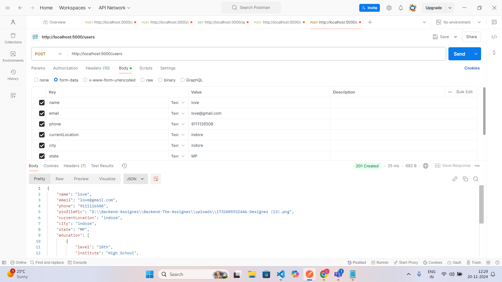

# Backend-The-Assigner

# Day-03 Task(Enroll form)

<h3>Enroll for service</h3>
<<<<<<< HEAD

<h3>Otp verification</h3>

=======

<h3>Otp verification</h3>

>>>>>>> ff133a5ea10869f7e2afdb49a219763a2f3f196c
