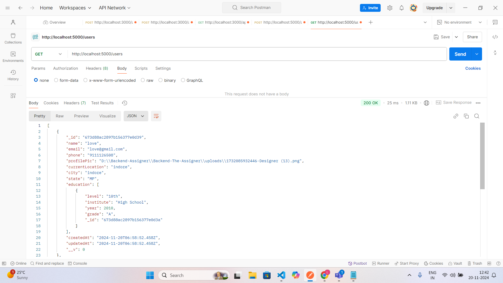
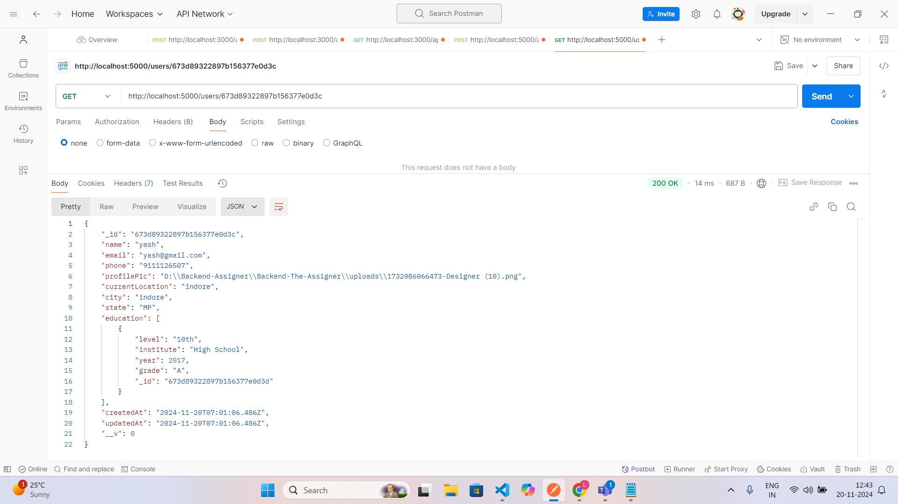
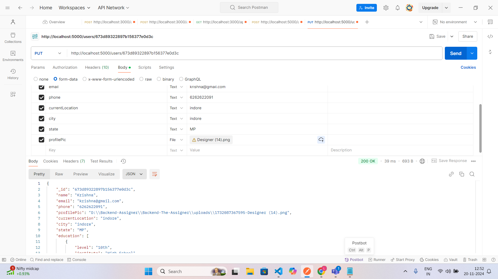
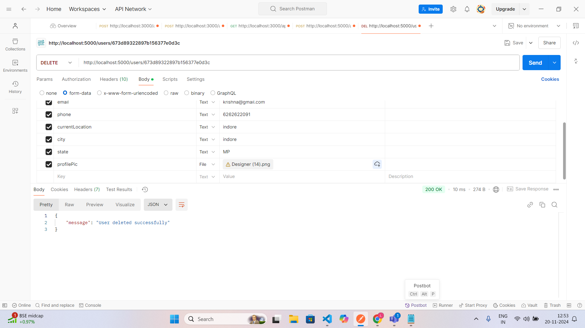

# Backend-The-Assigner
# Day-01 Task

# Day-02 Task(User Profile)

<h4>*create user*</h4>

<h4>*get all user*</h4>

<h4>*get user by id*</h4>

<h4>*Update user by id*</h4>

<h4>*Delete user by id*</h4>
